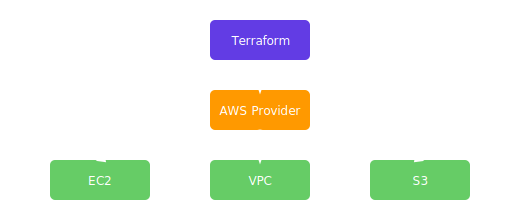

Terraform is an open-source tool that lets you define and provision cloud resources using declarative configuration files. With it you can version your infrastructure the same way you version your application code.

## How Terraform Works

Terraform reads configuration files written in the HashiCorp Configuration Language (HCL) and creates a plan for provisioning resources. The workflow generally follows these steps:

1. `terraform init` – initialize the working directory and download providers.
2. `terraform plan` – preview the changes Terraform will make.
3. `terraform apply` – create or update infrastructure to match the configuration.

## Example Configuration

Here is a minimal example that deploys an EC2 instance in AWS:

```hcl
provider "aws" {
  region = "us-east-1"
}

resource "aws_instance" "example" {
  ami           = "ami-0c55b159cbfafe1f0"
  instance_type = "t2.micro"
}
```

## Diagram

The diagram below shows Terraform interacting with AWS resources via the provider:



Terraform supports many providers beyond AWS, such as Azure, Google Cloud, and others. By storing your infrastructure definitions in code, you gain repeatability and can collaborate using version control.

