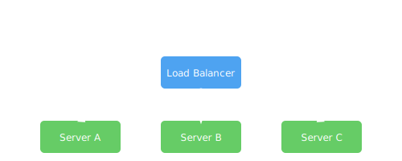

Load balancing is a fundamental technique for achieving scalability and reliability in web applications. A load balancer acts as a traffic manager sitting in front of your servers.

## Why Load Balancing?

Without a load balancer, a single server handles all client requests. This quickly becomes a bottleneck. By distributing requests across multiple backend servers, you can handle more traffic and maintain availability even if a server fails.

## Common Strategies

### Round-Robin

Round-robin sends each incoming request to the next server in line. It's simple and works well when servers are equally capable.

```nginx
upstream backend {
    server server1.example.com;
    server server2.example.com;
    server server3.example.com;
}

server {
    listen 80;
    location / {
        proxy_pass http://backend;
    }
}
```

### Least Connections

This algorithm forwards requests to the server with the fewest active connections. It's helpful when your servers handle workloads of varying duration.

### IP Hash

With IP hash, each client's IP address maps to a specific server. This ensures a client consistently reaches the same backend, which can be useful for session persistence.

### Application-Layer Load Balancing

At Layer 7 of the OSI model, load balancers make routing decisions based on HTTP headers, cookies, or application data. This allows advanced traffic management such as routing by URL path.

## Diagram

Below is a simplified view of traffic distribution to three backend servers:



Load balancers can be hardware appliances or software-based solutions. Cloud providers also offer managed options. Choosing the right strategy depends on your application's requirements, the type of traffic, and scaling goals.

